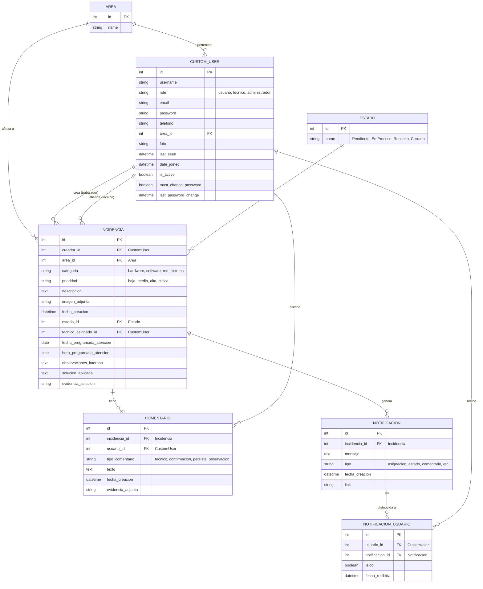
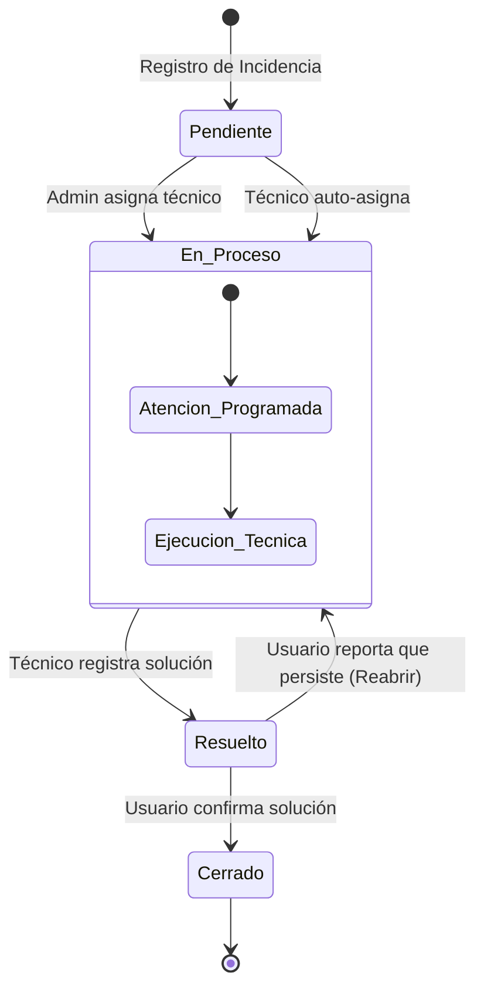
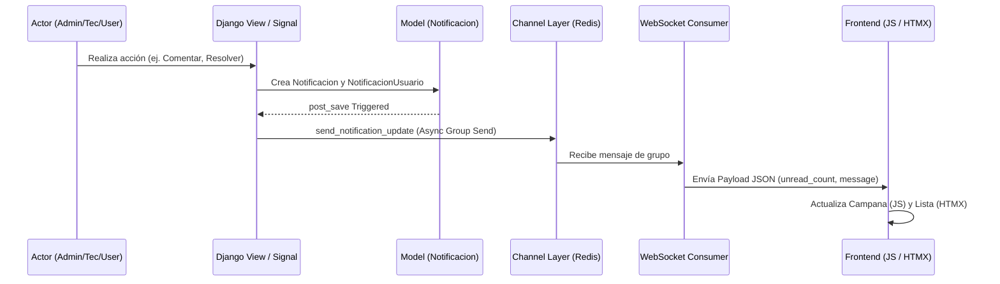
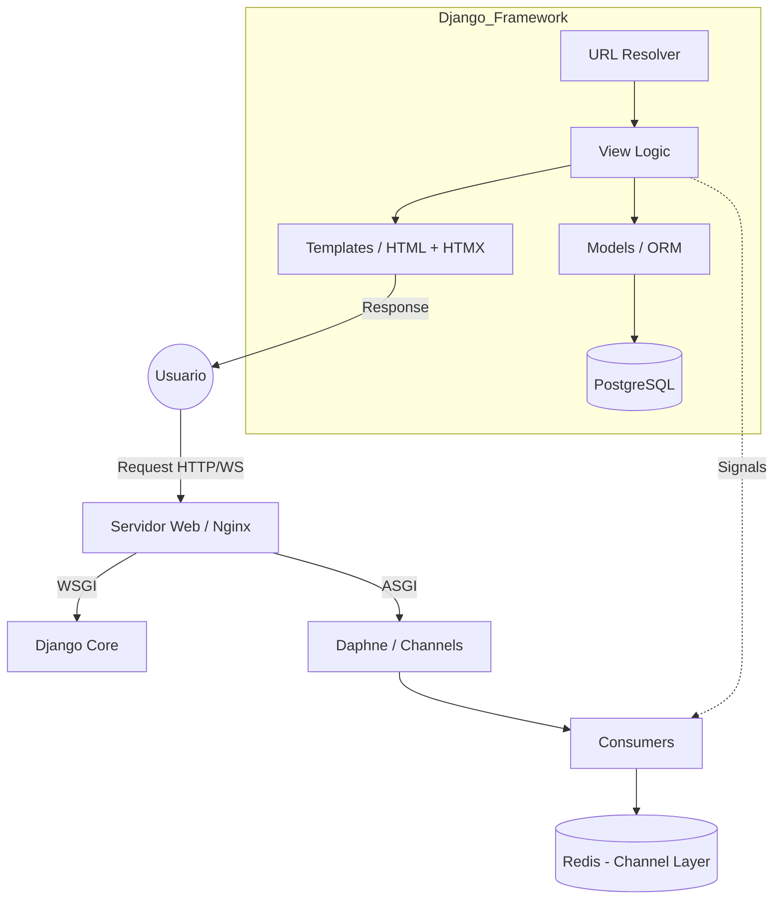
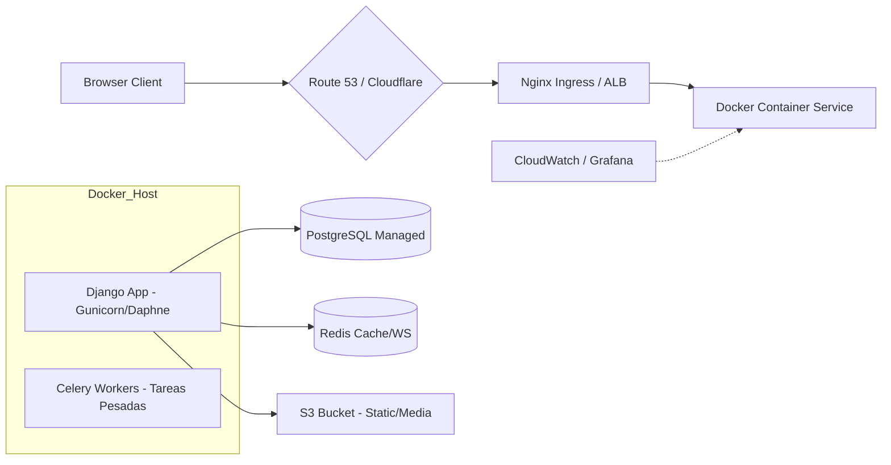
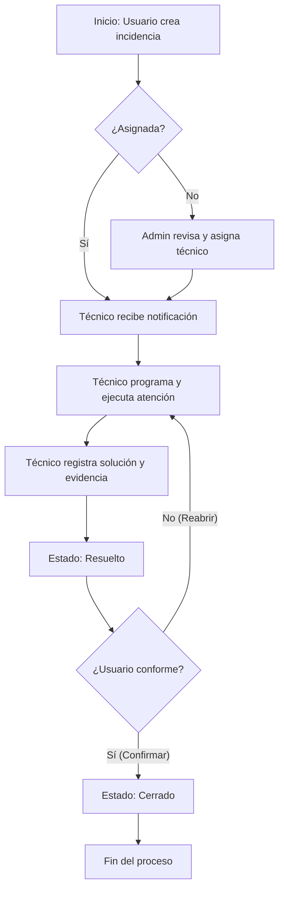
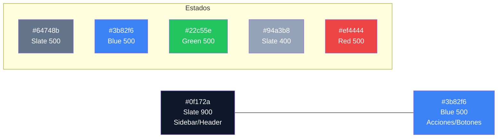
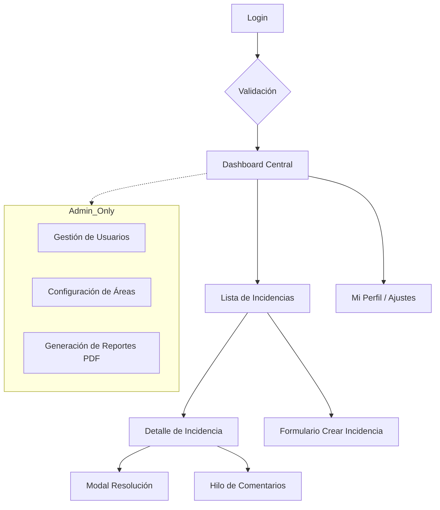
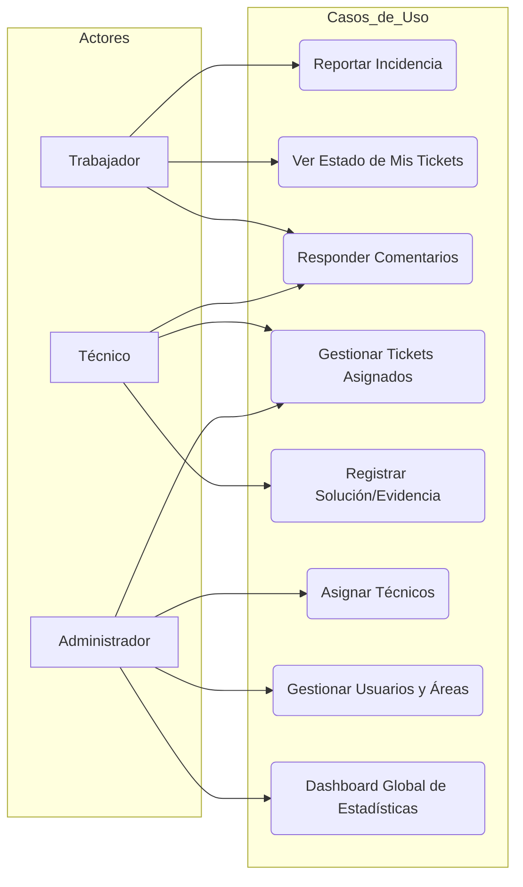

# Documentación Técnica Visual - Gestión de Incidencias V2 🏛️

Este documento contiene la arquitectura visual completa del sistema en formato **Mermaid.js**. Puedes visualizar estos diagramas instalando la extensión recomendada al final de este archivo.

---

## 📊 1. Diagrama Entidad-Relación (DER / MER)
*Diseñado para una arquitectura futura en producción con PostgreSQL.*

---

## 🔄 2. Diagrama de Flujo de Estados (Incidencias)
*Lógica real de transiciones del sistema.*

---

## 🔔 3. Diagrama de Secuencia (Notificaciones Real-Time)
*Evento → Signal → WebSocket → HTMX Interface.*

---

## 🏗️ 4. Arquitectura de Software (Patrón MVT + Real-time)

---

## ☁️ 5. Arquitectura de Infraestructura en la Nube (Cloud Deployment)

---

## 🔄 6. Diagrama de Flujo del Proceso de Atención

---

## 🎨 7. Paleta de Colores del Sistema

---

## 🧭 8. Diagrama de Navegación / Arquitectura de Pantallas

---

## 👥 9. Diagrama de Casos de Uso

---

## ⚙️ Recomendación de Extensión para VS Code

Para visualizar estos diagramas directamente en tu barra lateral de VS Code y exportarlos a PNG/SVG:

1.  Abre el panel de extensiones (`Ctrl+Shift+X`).
2.  Busca e instala: **Mermaid Editor** (de *yuzutech*) o **Markdown Mermaid Preview**.
3.  Para exportar:
    *   Con el archivo `.md` abierto, abre la vista previa (`Ctrl+Shift+V`).
    *   Haz clic derecho sobre el diagrama y selecciona **Save as image** (dependiendo de la extensión instalada).
    *   Se recomienda **Mermaid Markdown Syntex & Preview** para una integración más fluida.

> [!NOTE]
> Esta documentación está preparada para escalar a una base de datos **PostgreSQL** y despliegue con contenedores **Docker**.
